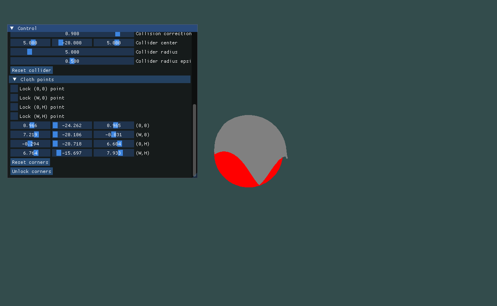

# cloth-sim

Simple cloth simulation using verlett integration.

It gives you control over:
- Corners
- Gravity
- Spring strength
- Camera

And more!

# Compiling

1. Clone [vcpkg](https://github.com/microsoft/vcpkg)
2. Run `make-build.sh` script
3. Go to `build` directory and run `make`

# License

License is in file LICENSE.md Whole project is MIT license, except of GeometricTools, which have their own separate license available in [libs/GeometricTools/LICENSE](libs/GeometricTools/LICENSE)